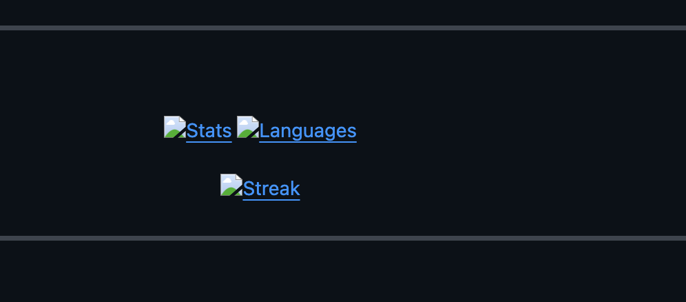
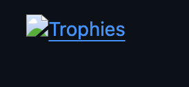

  <!-- AESPA x TWICE Header Gradient -->
  

  <!-- Integrated Visuals: Karina (Left) | Content (Center) | Sana (Right) -->
  <table border="0" width="100%">
    <tr>
      <td width="20%" align="center" valign="bottom">
        
      </td>
      <td width="60%" align="center">
        <!-- Animated Typing with Neon Colors -->
        
          
        

          
          
          
        

      </td>
      <td width="20%" align="center" valign="bottom">
        
      </td>
    </tr>
  </table>

<!-- Trophies with a Purple/Pink Theme if available, or just standard clean -->

  

 

---

###  The Dual Duality

> **"Savage on Chain, Sweet on Health."**

I engineer systems in two diverging worlds, unified by the drive for **Fairness** and **Autonomy**.

| **⌚ Motivue: Wearable Intelligence** | **🧱 Aequa Network: Fairness Layer** |
| :---: | :---: |
|  |  |
| **"Feel Special, Be Strong."** | **"Next Level Decentralization."** |
| 🚀 **Products**: Motiband & Motiring | ⚡ **Tech**: Modular DVT Engine (Go) |
| ❤️ **Vibe**: Health, Strength, Autonomy | 🛡️ **Vibe**: MEV Resistance, Neutrality |
| 🔮 **Tech**: AI4Sport Analytics | 🌐 **Goal**: The "Justice Layer" of Crypto |

---

### 🍭 Tech Stack & Palette

  
   
   
  

---

### 📊 MY WORLD (Stats)

  <!-- Synthwave Theme allows for that Purple/Pink Neon look -->
  
  

   
  <!-- Streak with customised color to match TWICE Apricot & Neon Pink -->
  

 

  

